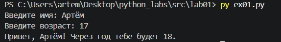
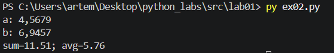
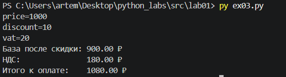
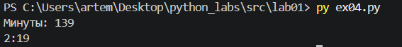
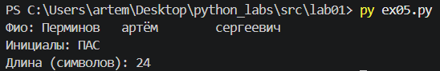

# Лабораторная работа №1
## Задание №1
```python
name = input("Введите имя: ")
age = int(input("Введите возраст: "))
print(f'Привет, {name}! Через год тебе будет {age+1}.')
```

## Задание №2
С помощью метода .replace() заменяем запятые для корректного ввода.
```python
a = float(input("a: ").replace(',','.'))
b = float(input("b: ").replace(',','.'))
sum = a + b
avg = sum/2
print(f'sum={sum:.2f}; avg={avg:.2f}')
```

## Задание №3
По аналогии с заданием 2 используем метод .replace(), а также f-строки и форматирование для вывода чисел с 2 числами после запятой.
``` python
price = float(input("price=").replace(',','.'))
discount = float(input("discount=").replace(',','.'))
vat = float(input("vat=").replace(',','.'))
base = price * (1 - discount/100)
vat_amount = base * (vat/100)
total = base + vat_amount
print(f'База после скидки: {base:.2f} ₽')
print(f'НДС:               {vat_amount:.2f} ₽')
print(f'Итого к оплате:    {total:.2f} ₽')
```

## Задание №4
Кол-во часов вычисляем как целую часть от деления кол-ва минут на 60, остаток от деления - кол-во минут.
```python
m = int(input("Минуты: "))
hours = m//60
mins = m - hours*60
print(f'{hours}:{mins:02d}')
```

## Задание №5
Считываем данные используя метод .split(), используем метод .upper(), чтобы получить верхний регистр для инициалов в случае некорректного их введения.
```python
fam, name, otch = [i for i in list(input("Фио: ").split())]
leng = len(fam) + len(name) + len(otch) + 2
print(f'Инициалы: {fam[0].upper()}{name[0].upper()}{otch[0].upper()}')
print(f'Длина (символов): {leng}')
```
